In one of the greatest cities in the world, NYC, we have an abundant amount of options to choose from when it comes to where we eat, whether we are looking for fine dining, fast food, or something in between. The cuisine choices seem just as endless. Is there a good way to help choose a restaurant to eat in or a general location? Although not an easy task, one thing we can all agree on is that nobody wants to eat in a restaurant ridden with health violations. In this project, we will explore and analyze NYC’s restaurant inspection results from 2013-2017 of the five boroughs.

We found this data set by exploring NYC open data sets. Our love for food and health made this a great option. One of our team members who recently moved to NYC is highly selective about food she eats due to her rare health condition and hence, having the kinds of questions mentioned above answered can prove to be a great asset to both her and others suffering from health conditions or who may just be picky eaters! The data can be found and downloaded here: https://data.cityofnewyork.us/Health/DOHMH-New-York-City-Restaurant-Inspection-Results/xx67-kt59

To download, click the export button on the right -> Download as -> choose your format. For this project, we are using CSV format.

First, let's load our data.
```{r}
ViolationsData <- read.csv(file="inspection.csv", header=TRUE, sep=",",as.is=TRUE)
```

In order to more easily work with our data let's ensure that every date is in a date format rather than a string and every string is a factor variable.
```{r message=FALSE}
library(dplyr)
library(tidyr)
##Date conversion
ViolationsData <- ViolationsData %>%
  mutate(INSPECTION.DATE= as.Date(INSPECTION.DATE, format= "%m/%d/%Y"))%>%
  mutate(GRADE.DATE= as.Date(GRADE.DATE, format= "%m/%d/%Y"))%>%
  mutate(RECORD.DATE= as.Date(RECORD.DATE, format= "%m/%d/%Y"))
##Factor conversion
ViolationsData <- ViolationsData %>%
  mutate(CUISINE.DESCRIPTION= as.factor(CUISINE.DESCRIPTION))%>%
  mutate(BORO= as.factor(BORO))%>%
  mutate(VIOLATION.CODE= as.factor(VIOLATION.CODE))%>%
  mutate(CRITICAL.FLAG= as.factor(CRITICAL.FLAG))%>%
  mutate(GRADE= as.factor(GRADE))%>%
  mutate(INSPECTION.TYPE= as.factor(INSPECTION.TYPE))
```

Let's take a look at the total amount of inspections in our data set by borough.
```{r}
library(ggplot2)
boroughPlot <- ggplot(ViolationsData, aes(BORO, fill=BORO))
boroughPlot + geom_bar()+ theme(legend.position="none") +
  ggtitle('Inspection count by Borough') + 
  labs(x = "Number of Inspections", y ="Borough")
```
Since we're interested in comparing Boroughs, let's get rid of data in which the Borough is missing. Clearly, there is a very small amount of such data as can be inferred from the plot above.

```{r}
ViolationsData <- ViolationsData %>% filter (BORO != "Missing")
```

Let's see if there are any patterns in the number of inspections done each year. Keep in mind that this data was downloaded on March 27th 2017 and so we will clearly not have as much data for the year of 2017.
```{r}
violationYearsPlot <- ggplot(ViolationsData, aes(factor(as.numeric(format(INSPECTION.DATE , '%Y'))), fill="Red"))
violationYearsPlot + geom_bar()+coord_flip()+ theme(legend.position="none") +xlab("Inspection Year")+ylab("Inspection Counts") + ggtitle("Inspection Count by Year")
```
We see that theredata for the 1900s. We will exclude these data points moving forward.

```{r}
ViolationsData <- ViolationsData %>% filter(
  as.numeric(format(INSPECTION.DATE , '%Y')) > 2012)
```

Let's put the two previous plots together
```{r}
boroughPlot <- ggplot(ViolationsData, aes(BORO,fill=BORO))
boroughPlot + geom_bar() + theme(legend.position="none") + 
  facet_wrap(~factor(as.numeric( format(INSPECTION.DATE , '%Y')))) + 
  ggtitle("Total Inspections from 2013-2017 in each Borough") +
  xlab("Borough") + ylab("Number of Inspections") +
  theme(axis.text.x = element_text(angle = 45, hjust = 1))
```
```{r,fig.width=8,fig.height=3}
inspection_grades <- ViolationsData %>% select(-CAMIS, -DBA, -BUILDING, -STREET, -ZIPCODE, -PHONE, -ACTION, -VIOLATION.CODE, -VIOLATION.DESCRIPTION, -CRITICAL.FLAG, -SCORE, -GRADE.DATE, -RECORD.DATE, -INSPECTION.TYPE,-CUISINE.DESCRIPTION)
inspection_grades_woyear<-inspection_grades %>% select(-INSPECTION.DATE)
inspection_grades_woyear <- inspection_grades_woyear %>% gather(key, value, -BORO) %>% group_by(BORO, key, value) %>% tally %>% spread(value, n, fill = 0)# %>% gather(blah, -BORO, -key) #summarize(aprop = A/(A+B+C+))
names(inspection_grades_woyear)[names(inspection_grades_woyear)=="key"] <- "grade"
names(inspection_grades_woyear)[names(inspection_grades_woyear)==""] <- "unknown"
inspection_grades_woyear <- inspection_grades_woyear %>% gather(key, value, -BORO,-grade)
RelFreq<-function(m){
   ((m )/sum(m))
 }
inspection_grades_woyear<-inspection_grades_woyear %>% group_by(BORO,grade) %>%
    mutate(percentage = (value/sum(value))*100)
ggplot(inspection_grades_woyear, aes(BORO, percentage ,fill= key)) + 
  geom_bar(stat="identity", position = "dodge") +
  ggtitle('%age Grade distribution across boroughs') + 
  labs(x = "boroughs", y ="percentage")+guides(fill=guide_legend(title="Grade"))

```
```{r,fig.height=20}
library(viridis)
nonYearDataForHeatMap<-ViolationsData %>% select(GRADE,ZIPCODE)
#nonYearDataForHeatMap<-nonYearDataForHeatMap%>%mutate(gradeYear=as.numeric(format(GRADE.DATE , '%Y')))
nonYearDataForHeatMap <- nonYearDataForHeatMap %>% group_by(GRADE,ZIPCODE) %>% tally 
RelFreq<-function(m){
   ((m )/sum(m))
}

nonYearDataForHeatMap<-  nonYearDataForHeatMap %>% group_by(ZIPCODE)%>%
    mutate(percentage = (n/sum(n))*100)

ggplot(nonYearDataForHeatMap, aes(GRADE, 
                        ZIPCODE, fill = percentage)) +
  geom_tile() +
  scale_fill_viridis() +
  #facet_wrap(~BORO)
  ggtitle("Percentage grade distribution by zipcode across years\n ")+
  theme(axis.text.x=element_text(angle=-45, hjust=.1),
        plot.title=element_text(margin=margin(b=.5), size = 15))+ylab("Grade")


```

```{r,fig.width=8}

inspection_grades_year<-inspection_grades%>% mutate(year=factor(as.numeric(format(INSPECTION.DATE , '%Y'))))
inspection_grades_year<-inspection_grades_year%>% select(-INSPECTION.DATE)
 inspection_grades_year <- inspection_grades_year %>% gather(key, value, -BORO,-year) %>% group_by(BORO,year, key, value) %>% 
   tally %>% spread(value, n, fill = 0)# %>% gather(blah, -BORO, -key) #summarize(aprop = A/(A+B+C+))
names(inspection_grades_year)[names(inspection_grades_year)=="key"] <- "grade"
names(inspection_grades_year)[names(inspection_grades_year)==""] <- "unknown"
inspection_grades_year <- inspection_grades_year %>% gather(key, value, -BORO,-grade,-year)
RelFreq<-function(m){
   ((m )/sum(m))
 }
inspection_grades_year<-inspection_grades_year %>% group_by(BORO,grade,year) %>%
    mutate(percentage = (value/sum(value))*100)
ggplot(inspection_grades_year, aes(BORO, percentage ,fill= key)) + 
  geom_bar(stat="identity", position = "dodge") +facet_wrap(~year,nrow=2,ncol=3)+
  guides(fill=guide_legend(title="Grade"))+
  ggtitle("%age grade distribution by BOROUGH")

```

```{r,fig.height=12}
ggplot(ViolationsData, aes(CUISINE.DESCRIPTION, fill = GRADE)) + geom_bar() + 
  coord_flip()+ggtitle("stacked bar chart of grade distributions across cuisines")
```

```{r,fig.height=12}
average_scores <- ViolationsData %>% select(-CAMIS, -DBA, -BUILDING, -STREET, -ZIPCODE, 
                                            -PHONE, -INSPECTION.DATE, -ACTION, 
                                            -VIOLATION.CODE, -VIOLATION.DESCRIPTION, 
                                            -CRITICAL.FLAG, -GRADE, -GRADE.DATE, 
                                            -RECORD.DATE, -INSPECTION.TYPE)

average_cuisine <- average_scores %>%  group_by(CUISINE.DESCRIPTION) %>% na.omit %>%
  summarize(average_score = mean(SCORE))
average_cuisine <- arrange(average_cuisine, -average_score)

ggplot(average_cuisine, aes(reorder(x = CUISINE.DESCRIPTION, --average_score), average_score, fill = CUISINE.DESCRIPTION)) + geom_bar(stat='identity') + coord_flip() + theme(legend.position = 'none')+ggtitle("Average score across cuisines")+xlab("Cuisine description")+ylab("average score")+geom_text(aes(label = sprintf("%.2f", average_score)),position=position_stack(vjust=0.5),
                                                                                                                     vjust = 0.5, size = 3)
```

```{r}
worst10 <- average_cuisine[1:10,]

ggplot(worst10, aes(reorder(x = CUISINE.DESCRIPTION, --average_score), average_score, fill = CUISINE.DESCRIPTION)) + geom_bar(stat='identity') + coord_flip() + theme(legend.position = 'none')+ggtitle("Average score of Worst 10 cuisines")+xlab("Cuisine description")+ylab("average score")+geom_text(aes(label = sprintf("%.2f", average_score)),position=position_stack(vjust=0.5))
```

Note the proximity of actual location of these cuisine.Interestingly American cuisines served the most do not make an appearnace.

```{r}
n <- nrow(average_cuisine)
best10 <- average_cuisine[(n- 10):n,]
best10 <- best10[order(best10$average_score),]

ggplot(best10, aes(reorder(x = CUISINE.DESCRIPTION, -average_score), average_score, fill = CUISINE.DESCRIPTION)) + geom_bar(stat='identity') + coord_flip() + theme(legend.position = 'none')+ggtitle("Average score of top 10 cuisines")+xlab("Cuisine description")+ylab("average score")+geom_text(aes(label = sprintf("%.2f", average_score)),position = position_dodge(width = 1),#position=position_stack(vjust=0.5)
                                                                                                                     vjust = 0.5, size = 4)
```

It is interesting that the "mysterious not applicable cuisine" is one of the best!

```{r}
average_borough <- average_scores %>%  group_by(BORO) %>% na.omit %>%
  summarize(average_score = mean(SCORE))

ggplot(average_borough, aes(reorder(x = BORO, --average_score), average_score, fill = BORO)) + geom_bar(stat='identity') + theme(legend.position = 'none')+ggtitle("Average score across boroughs")+xlab("Borough")+ylab("average score")+geom_text(aes(label = sprintf("%.2f", average_score)),position = position_dodge(width = 1),
                                                                                                                     vjust = -0.5, size = 3)
```

Note that we dont see a different pattern even if we viewed this adat across years.


```{r,fig.width=12}

violations<- ViolationsData %>% select(-CAMIS, -DBA, -BUILDING, -STREET, -ZIPCODE, 
                                            -PHONE, -INSPECTION.DATE, -ACTION, 
                                            -VIOLATION.CODE, 
                                            -CRITICAL.FLAG, -GRADE, -GRADE.DATE, 
                                            -RECORD.DATE, -INSPECTION.TYPE)

vs <- violations %>%  group_by(VIOLATION.DESCRIPTION) %>% na.omit %>%
  summarize(count = n())
vs <- arrange(vs, -count)

topviolations <- vs[1:10,]

library(stringr)
topviolations$viol = str_wrap(topviolations$VIOLATION.DESCRIPTION, width = 15)

ggplot(topviolations, aes(reorder(viol, -count), count,fill=viol)) + geom_bar(stat='identity') + 
  theme(legend.position = 'none')+ggtitle("Top 10 violations")+xlab("Violation description")+ylab("count")+geom_text(aes(label = sprintf("%.0f", count)),
                                                                                                                  position = position_dodge(width = 1),
                                                                                                                     vjust = -0.5, size = 7)
```

```{r}
# library(ggmap)
# library(zipcode)
# data(zipcode)
# zipsNYC<-zipcode %>% filter(state=='NY')
# joined<-merge(zipsNYC, ViolationsData, by.x='zip', by.y='ZIPCODE')#by = c('zip' = 'ZIPCODE'))
# 
# joined1 <- joined %>% 
#   mutate(GRADENEW = ifelse(GRADE=="", "missing", GRADE))
# joined1<-joined1 %>% select(latitude, longitude,GRADENEW)
# sapply(joined1, function(x) sum(is.na(x)))
# theme_set(theme_bw(16))
# 
# NYCMap <- qmap("NY", zoom = 10, color = "bw", legend = "topleft")
# 
# NYCMap +
#   geom_point(aes(x = as.numeric(as.character(longitude)), y = as.numeric(as.character(latitude)), colour = GRADENEW),
#              data = joined1) +
# scale_x_continuous(limits = c(-74.244, -73.677), expand = c(0, 0)) +
# scale_y_continuous(limits = c(40.507, 40.9009), expand = c(0, 0)) + theme(legend.position="right", legend.title = element_text(size=10),
#                                       legend.text = element_text(size=8))
```

```{r,fig.height=15}
#####GENERATE GRADE PROPOERTION DATASET BY YEAR FOR TABLEAU PLOTTING
zipdata<- ViolationsData %>% select(-CAMIS, -DBA, -BUILDING, -STREET, 
                                            -PHONE, -ACTION, 
                                            -VIOLATION.CODE, 
                                            -CRITICAL.FLAG, -SCORE, -GRADE.DATE, 
                                            -RECORD.DATE, -INSPECTION.TYPE, -VIOLATION.DESCRIPTION, -CUISINE.DESCRIPTION, -BORO) %>% na.omit()
zipdata$year<-factor(as.numeric( format(zipdata$INSPECTION.DATE , '%Y')))
zipdataGradePercentage <- zipdata %>%select(-INSPECTION.DATE) %>%gather(key, value, -ZIPCODE, -year) %>% group_by(ZIPCODE, year, key, value) %>%
  tally %>% spread(value, n, fill = 0) %>% summarize(aprop = A/(A+B+C), bprop = B/(A+B+C), cprop = C/(A+B+C) )

# ggplot(zipdataGradePercentage, aes(reorder(x = ZIPCODE, --aprop), aprop)) + geom_bar(stat='identity') + 
#   coord_flip() + facet_wrap(~year)
#   theme( axis.text = element_text(size = 3))
```
###PROPORTIONS OF A
```{r}

```
```{r}
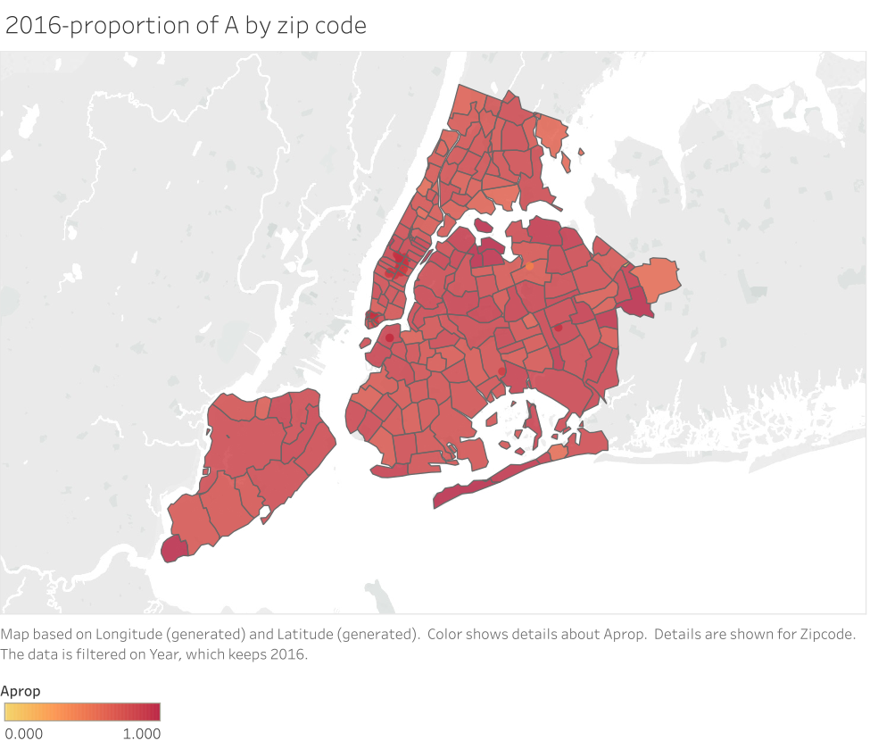
```
```{r}
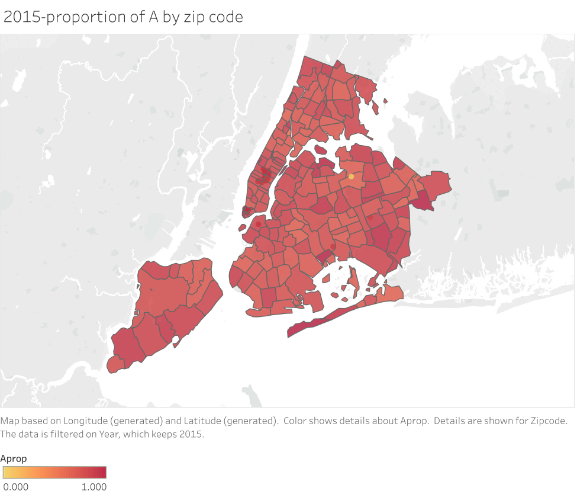
```
```{r}
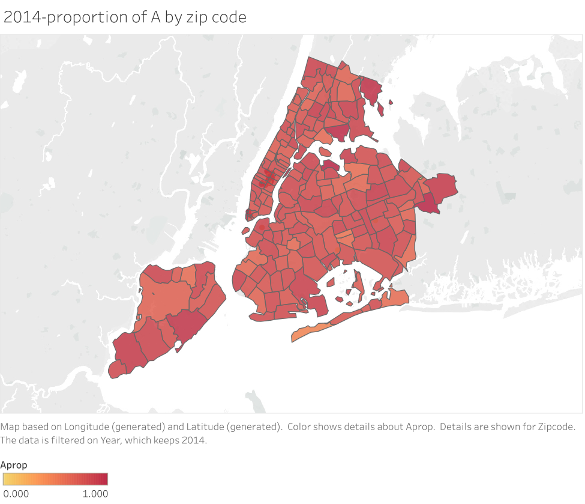
```
```{r}
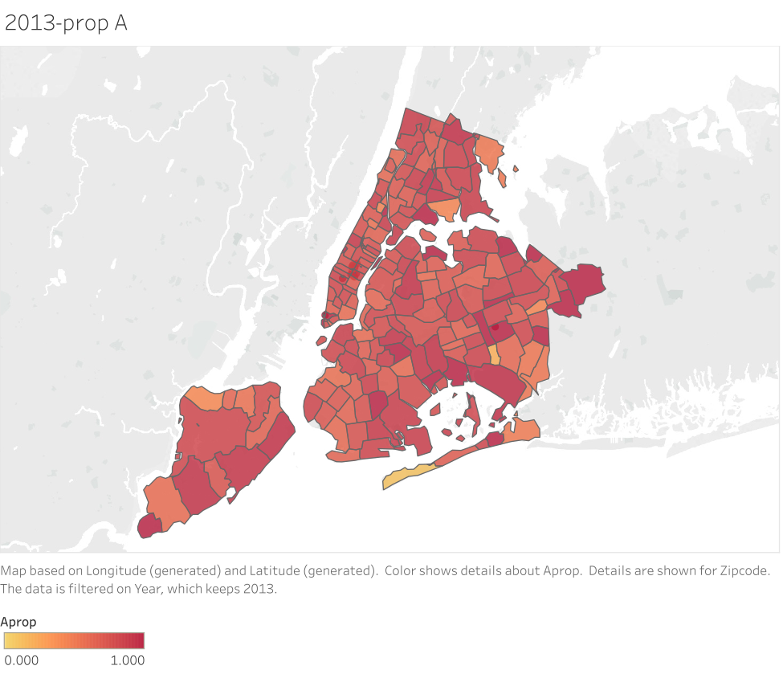
```

###PROPORTIONS OF B
```{r}
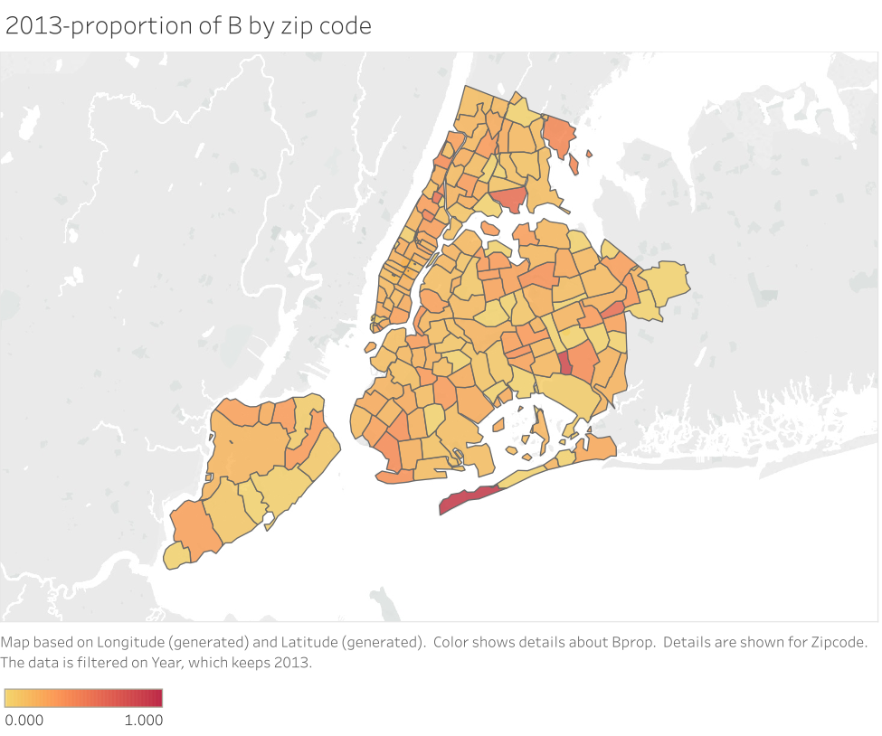
```
```{r}
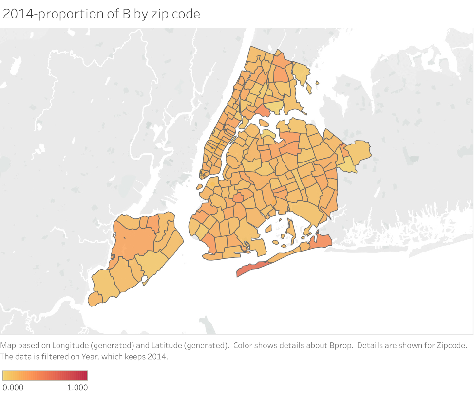
```
```{r}
knitr::include_graphics('Bprop3.png')
```
```{r}
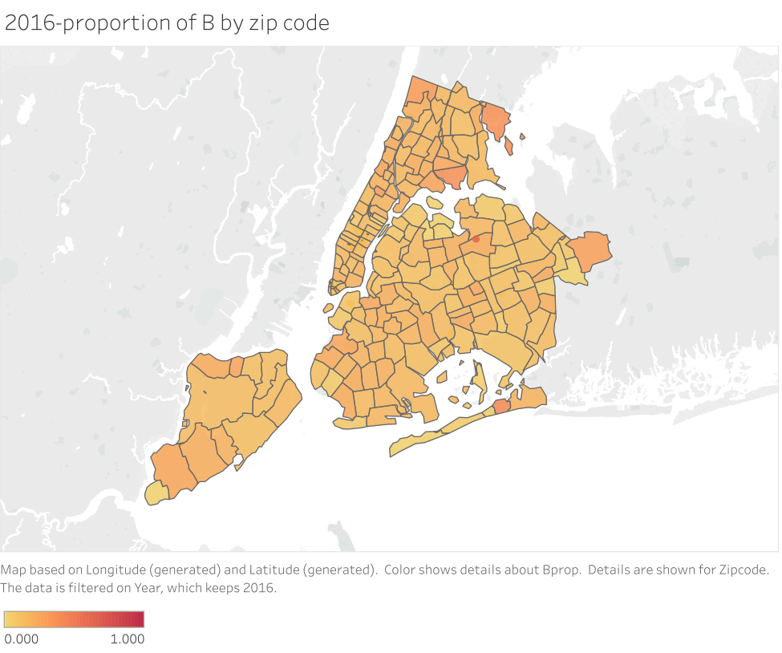
```
```{r}
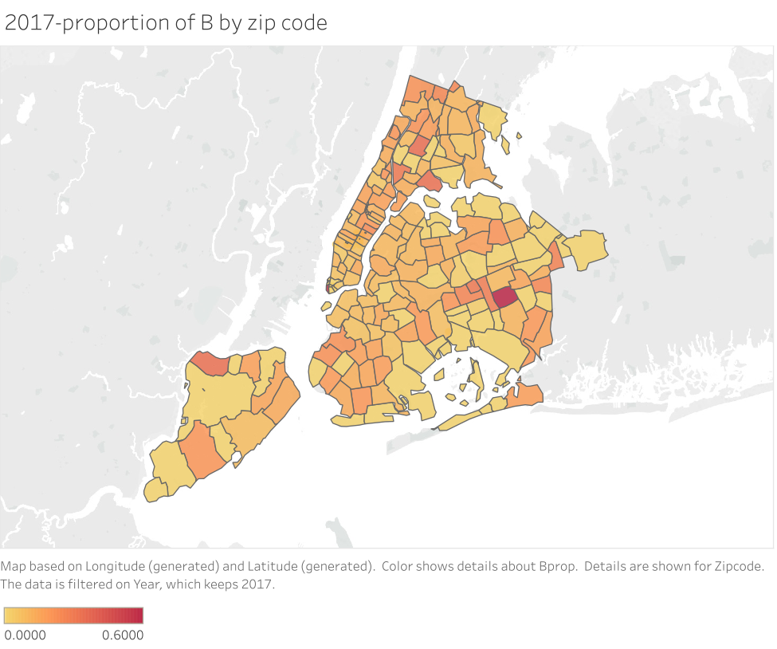
```

```{r}
###GENERATE AVERAGE VIOLATION SCORE BY ZIP CODE
average_scores_Zip <- ViolationsData %>% filter(ACTION=="Violations were cited in the following area(s).")%>%select(ZIPCODE,SCORE,INSPECTION.DATE,BORO)

average_scores_Zip <- average_scores_Zip %>%  group_by(ZIPCODE,factor(as.numeric( format(INSPECTION.DATE , '%Y')))) %>% na.omit %>%
  summarize(average_score = mean(SCORE))
#average_scores_Zip <- arrange(average_scores_Zip, -average_score)

```
###AVERAGE VIOLATION SCORE BY ZIP CODE
```{r}
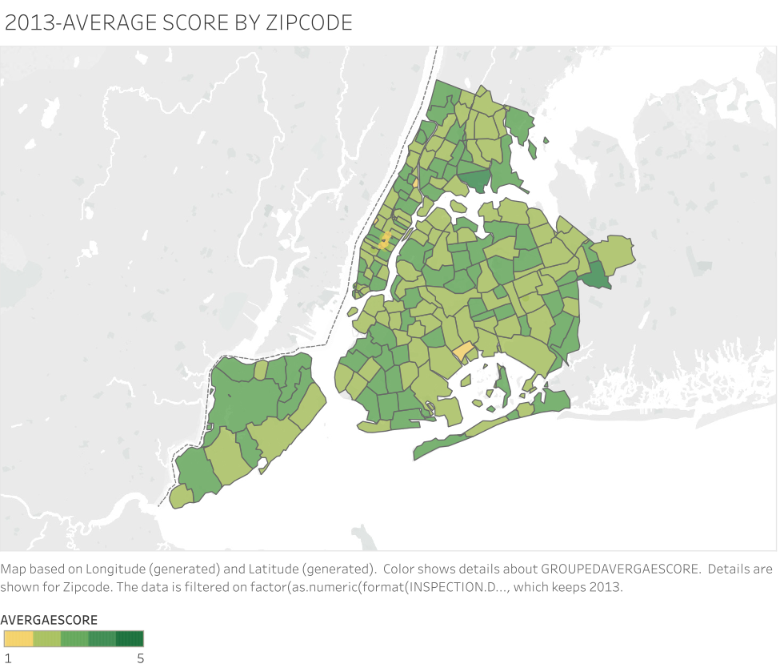
```
```{r}

```
```{r}
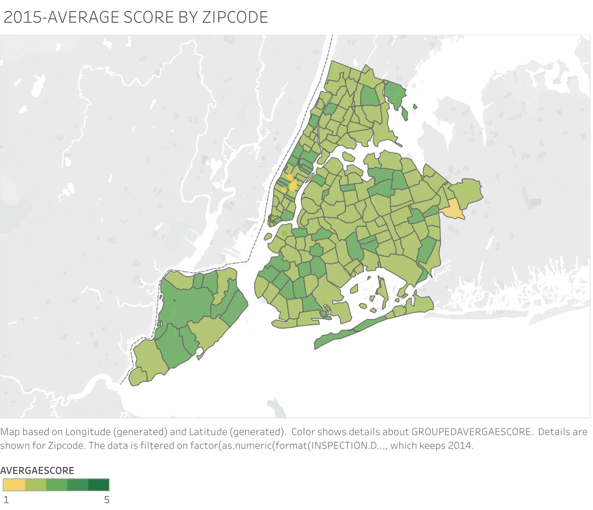
```
```{r}

```
```{r}
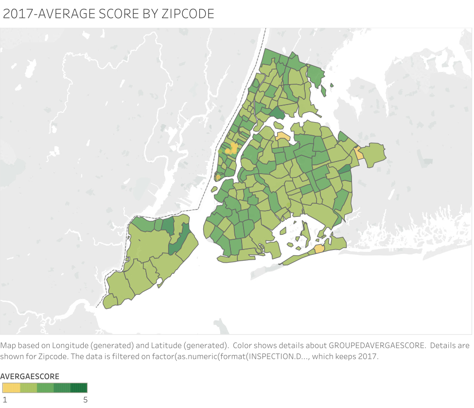
```
###AVERAGE VIOLATION SCORE BY ZIP CODE

```{r,fig.height=10}
 library(viridis)
mos<- ViolationsData %>% select(-CAMIS, -DBA, -BUILDING, -STREET, -ZIPCODE, 
                                           -PHONE, -ACTION, 
                                           -VIOLATION.CODE, 
                                           -CRITICAL.FLAG, -GRADE, -GRADE.DATE, 
                                           -RECORD.DATE, -SCORE, -CUISINE.DESCRIPTION, -VIOLATION.DESCRIPTION)
mos$year <- factor(as.numeric( format(mos$INSPECTION.DATE , '%Y')))
mos <- mos %>% select(-INSPECTION.DATE)

average_mos <- mos %>% group_by(BORO, year, INSPECTION.TYPE) %>% tally %>%
 group_by(BORO, year)  %>% 
 mutate(p = n / sum(n))
#average_cuisine <- arrange(average_cuisine, -average_score)

library(vcd)
average_mos <- average_mos %>% select(-n)


ggplot(average_mos, aes(BORO, 
                       INSPECTION.TYPE, fill = p)) +
 geom_tile() +
 scale_fill_viridis() +
 #facet_wrap(~BORO)
 ggtitle("AVERAGE VIOLATION SCORE BY ZIP CODE\n ")+
 theme(axis.text.x=element_text(angle=-45, hjust=.1),
       plot.title=element_text(margin=margin(b=.5), size = 15))+guides(fill=guide_legend(title="percentage"))

```
###REINSPECTIONS BY YEAR
```{r}
### DATA GENERATION
library(stringr)
reinspect <- ViolationsData %>% select(-CAMIS, -DBA, -BUILDING, -STREET, -CUISINE.DESCRIPTION, -BORO, -SCORE,
                                           -PHONE, INSPECTION.DATE, -ACTION, 
                                           -VIOLATION.CODE, 
                                           -CRITICAL.FLAG, -GRADE, -GRADE.DATE, 
                                           -RECORD.DATE)
reinspect$year<-factor(as.numeric( format(reinspect$INSPECTION.DATE , '%Y')))

#inspection_types <- INSPECTION.TYPE
reinspect <- reinspect %>%select(-INSPECTION.DATE)  %>% na.omit %>% filter(str_detect(INSPECTION.TYPE, "Re-inspection"))%>%group_by(VIOLATION.DESCRIPTION, year, ZIPCODE )  %>% tally# summarise(re = sum(str_count(reinspect$INSPECTION.TYPE, "Re-inspection")))
```
```{r}
knitr::include_graphics('AvgReinspect2013.png')
```
```{r}
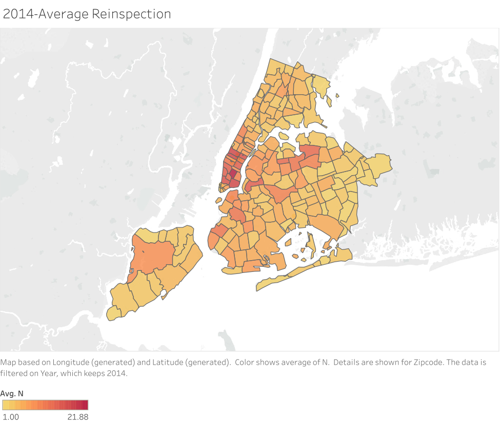
```
```{r}

```
```{r}

```
```{r}
knitr::include_graphics('AvgReinspect2017.png')
```

```{r,fig.width=5}
CriticalityData<- ViolationsData %>% select(BORO,INSPECTION.DATE,CRITICAL.FLAG) %>% na.omit()
CriticalityData$year<-factor(as.numeric( format(CriticalityData$INSPECTION.DATE , '%Y')))
#CriticalityData <- CriticalityData %>%select(-INSPECTION.DATE)

CriticalityData <- CriticalityData %>%select(-INSPECTION.DATE) %>%gather(key, value, -BORO, -year) %>% group_by(BORO, year,key,value) %>%tally %>% spread(value, n, fill = 0)
names(CriticalityData)[5] <- "NotApplicable"
names(CriticalityData)[6] <- "NonCritical"

CriticalityDataPercentage<-CriticalityData %>% summarize(criticalPercent = Critical/(Critical+NotApplicable+NonCritical), NotApplicablePercent = NotApplicable/(Critical+NotApplicable+NonCritical), NonCriticalPercent = NonCritical/(Critical+NotApplicable+NonCritical))#

names(CriticalityDataPercentage)[4] <- "Critical"
names(CriticalityDataPercentage)[5] <- "NotApplicable"
names(CriticalityDataPercentage)[6] <- "NonCritical"
CriticalityDataPercentage<-CriticalityDataPercentage%>% gather(key1, value, -BORO, -year,-key)


ggplot(CriticalityDataPercentage, aes(BORO, value, fill = key1)) + 
  geom_bar(stat="identity", position = "dodge") + 
  scale_fill_brewer(palette = "Set1")+ xlab("BOROUGH")+ylab("CRITICALITY PERCENTAGES") +theme(axis.text.x = element_text(angle = 45, hjust = 1))+ ggtitle("Grouped barchart of grade frequency in each cuisine category \n when there was a violation reported")+facet_wrap(~year,nrow=2,ncol=3)+guides(fill=guide_legend(title="Criticality \n category"))


```


###DUNKIN DONUTS AND STARBUCKS ANALYSIS
```{r}
##DATA GENERATION CODE
library(stringr)
ChainssDf<-ViolationsData%>% mutate(isStarbucks=str_detect(DBA,"STARBUCK")) %>% mutate(isDunkin=str_detect(DBA,"DUNKIN"))
ChainssDf$DBA[ChainssDf$isStarbucks==TRUE]<-"STARBUCKS"
ChainssDf$DBA[ChainssDf$isDunkin==TRUE]<-"DUNKIN"
ChainssDf<-ChainssDf%>%filter(DBA %in% c("STARBUCKS","DUNKIN"))
ChainssDf<-ChainssDf%>%select(DBA,BORO,INSPECTION.DATE,ZIPCODE,SCORE,VIOLATION.DESCRIPTION,GRADE)
ChainssDf$year<-factor(as.numeric( format(ChainssDf$INSPECTION.DATE , '%Y')))
ChainssDf<-ChainssDf%>%select(-INSPECTION.DATE)
```
```{r}
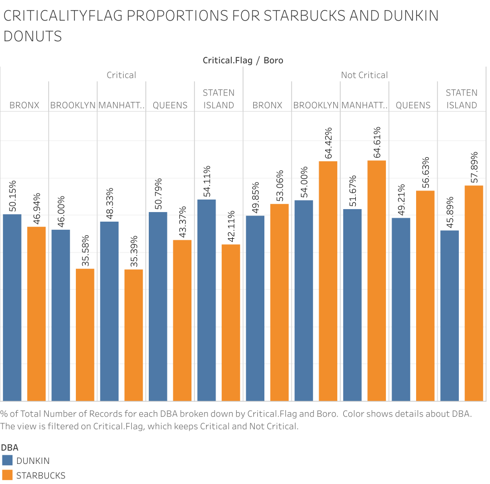
```
```{r}
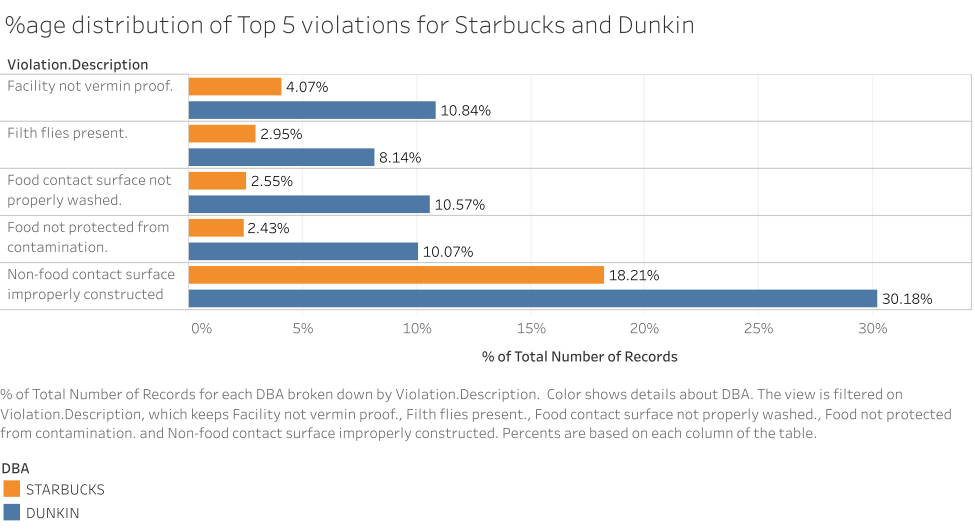
```
```{r}
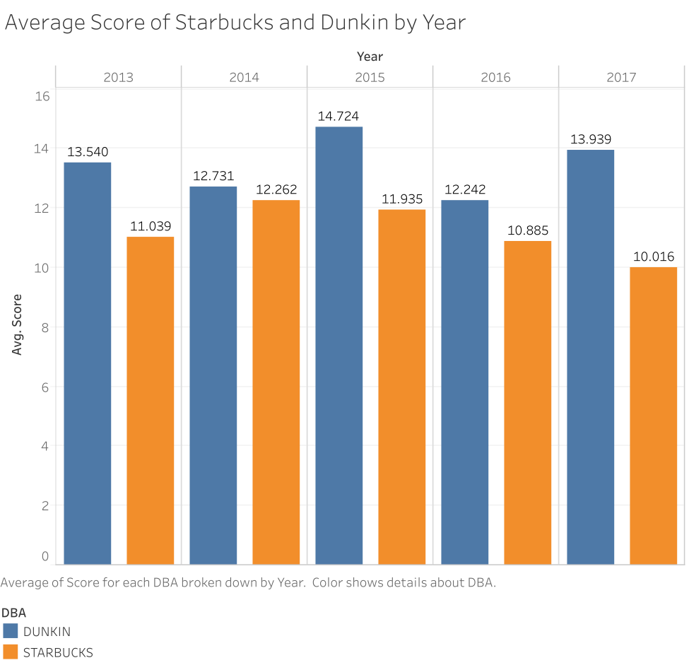
```
```{r}
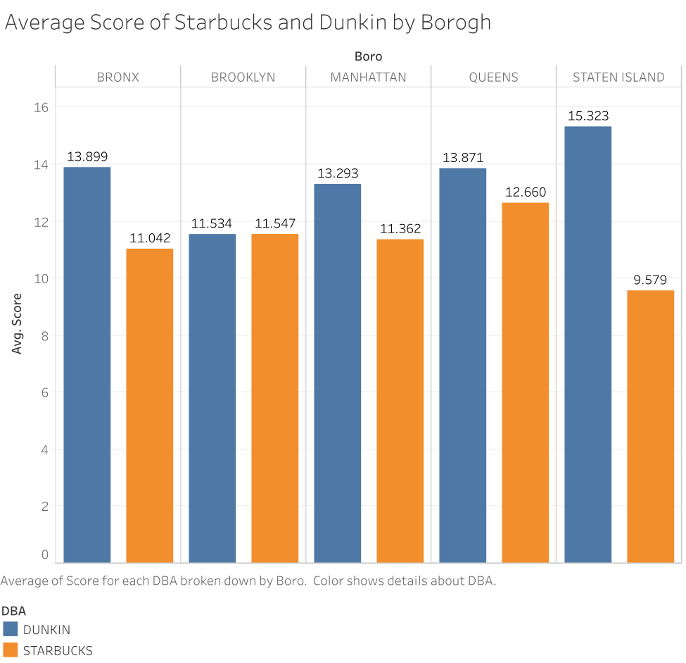
```


```{r}
### NOT SURE WHY WE HAD THIS
library(plyr)
counts <- ddply(ChainssDf, .(ChainssDf$year, ChainssDf$BORO, ChainssDf$DBA,ChainssDf$CRITICAL.FLAG), nrow)
names(counts)<-c("year","BORO","DBA","CriticalityFlag","count")
require(dplyr)
countsPercent<-counts %>% group_by(DBA,CriticalityFlag,year,BORO) %>% mutate(percentage = count/sum(count))
```

```{r}

```


