## Introduction

In one of the greatest cities in the world, NYC, we have an abundant amount of options to choose from when it comes to where we eat, whether we are looking for fine dining, fast food, or something in between. The cuisine choices seem just as endless. Is there a good way to help choose a restaurant to eat in or a general location? Although not an easy task, one thing we can all agree on is that nobody wants to eat in a restaurant ridden with health violations. In our project, we will explore and analyze NYC’s restaurant inspection results from 2013-2017 of the five boroughs.

We are interested in answering:

1. Which cuisines have the least and most violations along with their associated score.

2. What parts of NYC have the least and most violations?

3. We hypothesize that location is highly associated with inspection grade and so we will be searching for patterns between these variables.

4. We are also interested in seeing how inspection grade and score changes over time (years) based upon cuisine and location.

5. A description of violations is also provided in the data and we would like to better understand the common causes of those violations based upon the description.

6. Is there a pattern/trend in violations/inspection score/grade based upon restaurant chains?

We found this data set by exploring NYC open data sets. Our love for food and health made this a great option. One of our team members who recently moved to NYC is highly selective about the food she eats due to her rare health condition and hence, having the kinds of questions mentioned above answered can prove to be a great asset to both her and others suffering from health conditions or who may just be picky eaters! The data can be found and downloaded here: https://data.cityofnewyork.us/Health/DOHMH-New-York-City-Restaurant-Inspection-Results/xx67-kt59

To download, click the export button on the right -> Download as -> choose your format. For this assignement we used the CSV format.

## Team

##### Team Members:
+ Jonathan Galsurkar
+ Lakshya Garg

##### Task Distribution
Get table format for this

## Analysis of Data Quality
To begin our analysis of data quality, let's load our data.
```{r}
ViolationsData <- read.csv(file="inspection.csv", header=TRUE, sep=",", as.is=TRUE)
```

In order to more easily work with our data let's ensure that every date is in a date format rather than a string and every string is a factor variable.
```{r message=FALSE}

library(dplyr)
library(tidyr)
##Date conversion
ViolationsData <- ViolationsData %>%
  mutate(INSPECTION.DATE= as.Date(INSPECTION.DATE, format= "%m/%d/%Y"))%>%
  mutate(GRADE.DATE= as.Date(GRADE.DATE, format= "%m/%d/%Y"))%>%
  mutate(RECORD.DATE= as.Date(RECORD.DATE, format= "%m/%d/%Y"))
##Factor conversion
ViolationsData <- ViolationsData %>%
  mutate(CUISINE.DESCRIPTION= as.factor(CUISINE.DESCRIPTION))%>%
  mutate(BORO= as.factor(BORO))%>%
  mutate(VIOLATION.CODE= as.factor(VIOLATION.CODE))%>%
  mutate(CRITICAL.FLAG= as.factor(CRITICAL.FLAG))%>%
  mutate(GRADE= as.factor(GRADE))%>%
  mutate(INSPECTION.TYPE= as.factor(INSPECTION.TYPE))
```


Many of the questions we are interested in answering involve trends across restuarant locations. We first checked to see the number of restuarant inspections by borough. From the plot below, we noticed that there were a number of inspections in which the Borough information was missing and won't help our analysis.
```{r}
library(ggplot2)
boroughPlot <- ggplot(ViolationsData, aes(BORO, fill=BORO))
boroughPlot + geom_bar()+ theme(legend.position="none") +
  ggtitle('Inspection Count by Borough') + 
  labs(x = "Borough", y ="Number of Inspections")
```

Another main feature of our data set is the inspection year since we wish to explore patters in inspection grades/scores over the years. From the plot below, we noticed that there is almost no inspection data before 2013 and surprisingly more inspection data in 1900 than 2012 and 2011. We decided to only work with data from 2013 and up. It is important to note that the number of inspections for 2017 is low since the 2017 data is only available from January - March.
```{r}
violationYearsPlot <- ggplot(ViolationsData, aes(factor(as.numeric(format(INSPECTION.DATE, '%Y'))), fill="Red"))
violationYearsPlot + geom_bar()+coord_flip()+ theme(legend.position="none") +xlab("Inspection Year")+ylab("Inspection Counts") + ggtitle("Inspection Count by Year")
```

Another crucial feature of our data set is grade a restaurant received after inspection. We decided to plot a stacked bar chart for to see the count of each type of grade for every cuisine. We used a stacked bar chart because we wanted to quickly assess the magnitude missing without taking up extra room. From the plot below, it was shocking to see that we generally had more missing grades than grades. This was true regardlss of cuisine. It was also interested that the grades were purely missing and not categorized as "Not Yet Graded".
```{r,fig.height=12}
ggplot(ViolationsData, aes(CUISINE.DESCRIPTION, fill = GRADE)) + geom_bar() + 
  coord_flip()+ggtitle("stacked bar chart of grade distributions across cuisines")
```

To stay on the topic of grades, after researching the letter grading program, we found the following information: 
+ A score of less than 14 points on either initial or re-inspection results in an “A” grade
+ On re-inspection, a score of 14-27 points means a restaurant receives both a “B” grade and a “Grade Pending” card.
+ On re-inspection, a score of 28 or more points means a restaurant receives both a “C” grade and a “Grade Pending” card.

Both Z and P represent grade pending, however P represents a Grade Pending issued on re-opening following an initial inspection that resulted in a closure.

We also discovered that not every inspection is "gradable". Gradable inspections have the following properties:

+ INSPECTION TYPE in (Cycle Inspection/Initial Inspection, Cycle Inspection/Re-Inspection, Pre-Permit (Operational)/Initial Inspection, Pre-Permit (Operational)/Re-Inspection)
+ ACTION in (Violations were cited in the following area(s), No violations were recorded at the time of this inspection, Establishment Closed by DOHMH)
+ INSPECTION DATE > July 26, 2010

This can probably explain a fair amount of the missing grade data observed in our plot.

According to the ABOUT the data set page: The SCORE and GRADE fields may be inconsistent with each other because of limitations or errors in the data systems. That is to say, scores of 0-13, 14-27 and 28+ are not always accompanied by A, B and C grades, respectively, when they should be. There may also be cases where a grade card was given out but a record of that grade issuance is missing from the data system, and therefore missing from this dataset, even though the SCORE field is populated.  Note that when initial inspections are adjudicated down to the A range, the absence of an accompanying grade associated with that inspection is correct, because the grade would not be assigned until the re-inspection is performed. 

To gain some final insight on the data quality, we decided to plot the relationshp between the number of missing scores by grade and by whether or not a violation was reported. We transformed the actions taken into three categories:
1. No violations were recorded at the time of this inspection to No Violation
2. Any action reported to Violation reported
3. Missing actions to NA
We then counted if the score was provided or not.

```{r,fig.height=4}
library(dplyr)
library(tidyr)
score_grade <- ViolationsData[ -c(1:9, 11:13, 16:18) ]
score_grade[score_grade == ''] <- NA
score_grade_combos <- score_grade  %>% mutate(missing_score = ifelse(is.na(SCORE), "yes", "no"))
score_grade_missing <- count(score_grade_combos, c('GRADE', 'missing_score', 'ACTION'))
score_grade_missing <- score_grade_missing %>% 
  mutate(violation = ifelse(ACTION == 'No violations were recorded at the time of this inspection.', 
                                          "No violation", 
                            ifelse(is.na(score_grade_missing$ACTION), NA, "Violation Reported"))) %>%
  select(-c(ACTION))
ggplot(score_grade_missing, aes(x = GRADE, y = log(freq), fill = missing_score)) + 
  geom_bar(stat = 'identity', position = 'dodge') + facet_wrap(~violation) + 
  ggtitle("Grade and missing score combinations by violation report") +
  labs(x = "Grade", y = "Log(Frequency)")
```
Interesting insights from plot above are:

1. Grades of NA reported high frequency of score in both No violation and violation reported category.

2. At first, it appears that high scores are related to low grades or needs grading but then we find restaurants with a grade of A that has the same score as a restaurant with a grade of C.

3. Another insight by just looking at the data is we surprisingly saw that restaurants with a critical flag still receive grades of A.This needs further analysis. SHOULD WE MAKE A PLOT FOR THIS????

## Executive Summary
NYC puts a lot of time and money into inspecting restuarants. Why would they go through all this trouble? To ensure quality meals and satisfaction of NYC residents of course! It is important for restaurants and establishment that meet at least the minimum requirements of health and safety regulations in order to promote less food sick residents and a cleaner NYC. 

How can we tell if these inspections are actually working to promote restuarants to meet regulations? Let's take a look at the proportion of scores that were graded an A in 2013 and the proportion of scores that were graded an A in 2016. Let's view this information by location so that you know what neighborhood to choose when you're craving a restaurant.

```{r echo = FALSE}
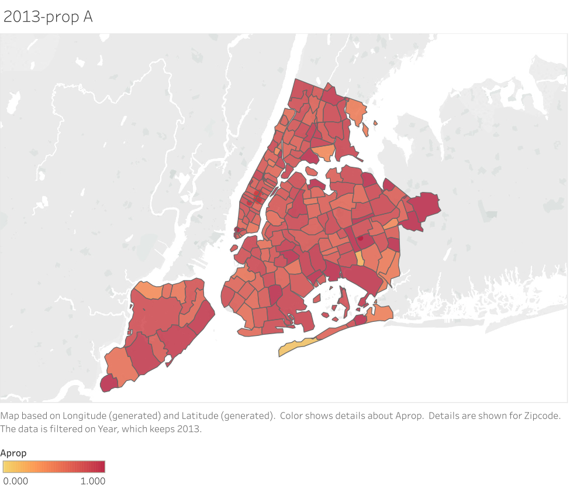
```

```{r echo = FALSE}
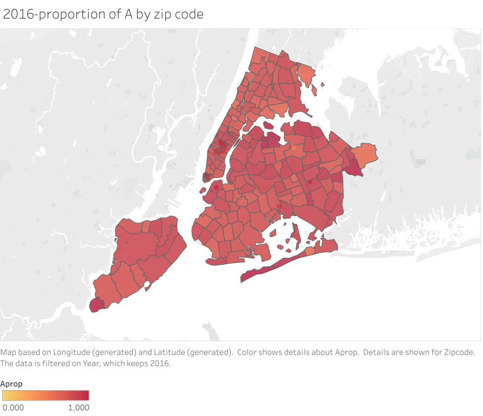
```

The darker the shade of red, the higher proportion of A grades. It is clear that over the last 3 years, the proportion of restuarants with a grade of an A has inscreased. NYC inspections must be working to improve the quality of the restuarants we eat in! In 2013, it seems that the there were only a few neighborhoods with an extremely high proportion of A grades. Only 3 areas in Staten Island, 1 in Long Island, a few in Brooklyn, Manhattan, and the Bronx. In 2016 on the other hand, the proportion of A grades is very high almost regardles of neighborhood. Keep it up NYC restaruant inspections!

TO see this from another angle, let's look at the average scores per neighborhood in 2013 and 2016. THEY WERE BINNED THIS WAYJFDHJKHFLSDFFSD

```{r echo = FALSE}
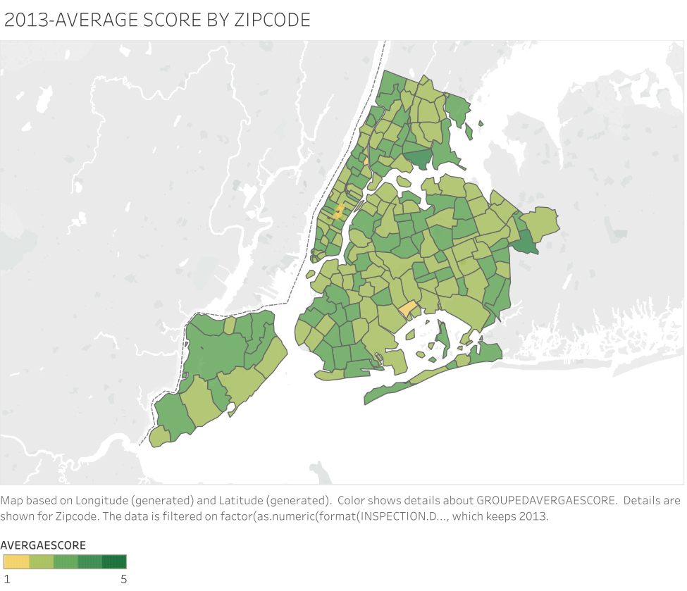
```

```{r echo = FALSE}

```

Just look how much lighter the color of each neighborhood got! Lighter colors mean a lower average score, which correlates to less violations and a healthier establishment!

Well now we know what neighborhoods to be in for establishments with low scores and A grades, but what are the average scores based upon cuisine?

```{r echo = FALSE}
average_cuisine <- ViolationsData %>%  group_by(CUISINE.DESCRIPTION) %>% na.omit %>%
  summarize(average_score = mean(SCORE))
average_cuisine <- arrange(average_cuisine, -average_score)

average_cuisine <- average_scores %>%  group_by(CUISINE.DESCRIPTION) %>% na.omit %>%
  summarize(average_score = mean(SCORE))
average_cuisine <- arrange(average_cuisine, -average_score)
```

```{r echo=FALSE}
n <- nrow(average_cuisine)
best10 <- average_cuisine[(n- 10):n,]
best10 <- best10[order(best10$average_score),]

ggplot(best10, aes(reorder(x = CUISINE.DESCRIPTION, -average_score), average_score, fill = CUISINE.DESCRIPTION)) + geom_bar(stat='identity') + coord_flip() + theme(legend.position = 'none')+ggtitle("Average score of top 10 cuisines")+xlab("Cuisine description")+ylab("average score")+geom_text(aes(label = sprintf("%.2f", average_score)),position = position_dodge(width = 1),#position=position_stack(vjust=0.5)
                                                                                                                     vjust = 0.5, size = 4)
```

```{r echo = FALSE}
worst10 <- average_cuisine[1:10,]

ggplot(worst10, aes(reorder(x = CUISINE.DESCRIPTION, --average_score), average_score, fill = CUISINE.DESCRIPTION)) + geom_bar(stat='identity') + coord_flip() + theme(legend.position = 'none')+ggtitle("Average score of Worst 10 cuisines")+xlab("Cuisine description")+ylab("average score")+geom_text(aes(label = sprintf("%.2f", average_score)),position=position_stack(vjust=0.5))
```

It is interesting that Not Listed/Not Applicable and Other made it to the top 10 but there you have it, the best and worst cuisines based upon their average scores.

## Main Analysis
After analyzing the quality of the data set, we got rid of data in which the Borough is missing and the year is before 2013.

```{r}
ViolationsData <- ViolationsData %>% filter (BORO != "Missing")
ViolationsData <- ViolationsData %>% filter(
  as.numeric(format(INSPECTION.DATE , '%Y')) > 2012)
```

Now we can get a better picture of the total number of inspections by year and borough.
```{r}
boroughPlot <- ggplot(ViolationsData, aes(BORO,fill=BORO))
boroughPlot + geom_bar() + theme(legend.position="none") + 
  facet_wrap(~factor(as.numeric( format(INSPECTION.DATE , '%Y')))) + 
  ggtitle("Total Inspections from 2013-2017 in each Borough") +
  xlab("Borough") + ylab("Number of Inspections") +
  theme(axis.text.x = element_text(angle = 45, hjust = 1))
```
After 2013, there seems to be a consistent amount of inspections acros the years. The number of inspections by borough also seems to make sense since we expect Manhattan to have the largest number of restuarants.

Next, we took a look at the grade distribution by borough.
```{r,fig.width=8,fig.height=3}
inspection_grades <- ViolationsData %>% select(-CAMIS, -DBA, -BUILDING, -STREET, -ZIPCODE, -PHONE, -ACTION, -VIOLATION.CODE, -VIOLATION.DESCRIPTION, -CRITICAL.FLAG, -SCORE, -GRADE.DATE, -RECORD.DATE, -INSPECTION.TYPE,-CUISINE.DESCRIPTION)

inspection_grades_woyear<-inspection_grades %>% select(-INSPECTION.DATE)

inspection_grades_woyear <- inspection_grades_woyear %>% gather(key, value, -BORO) %>% group_by(BORO, key, value) %>% tally %>% spread(value, n, fill = 0)# %>% gather(blah, -BORO, -key) #summarize(aprop = A/(A+B+C+))
names(inspection_grades_woyear)[names(inspection_grades_woyear)=="key"] <- "grade"
names(inspection_grades_woyear)[names(inspection_grades_woyear)==""] <- "unknown"
inspection_grades_woyear <- inspection_grades_woyear %>% gather(key, value, -BORO,-grade)
RelFreq<-function(m){
   ((m )/sum(m))
 }
inspection_grades_woyear<-inspection_grades_woyear %>% group_by(BORO,grade) %>%
    mutate(percentage = (value/sum(value))*100)
ggplot(inspection_grades_woyear, aes(BORO, percentage ,fill= key)) + 
  geom_bar(stat="identity", position = "dodge") +
  ggtitle('%Grade distribution across boroughs') + 
  labs(x = "boroughs", y ="percentage")+guides(fill=guide_legend(title="Grade"))

```
We initially hypothesized that we would see a pattern in grade distribution by borough, however, the plot shows us that grade distributions are almost the same regardless of borough.

```{r,fig.width=8}

inspection_grades_year<-inspection_grades%>% mutate(year=factor(as.numeric(format(INSPECTION.DATE , '%Y'))))
inspection_grades_year<-inspection_grades_year%>% select(-INSPECTION.DATE)
 inspection_grades_year <- inspection_grades_year %>% gather(key, value, -BORO,-year) %>% group_by(BORO,year, key, value) %>% 
   tally %>% spread(value, n, fill = 0)# %>% gather(blah, -BORO, -key) #summarize(aprop = A/(A+B+C+))
names(inspection_grades_year)[names(inspection_grades_year)=="key"] <- "grade"
names(inspection_grades_year)[names(inspection_grades_year)==""] <- "unknown"
inspection_grades_year <- inspection_grades_year %>% gather(key, value, -BORO,-grade,-year)
RelFreq<-function(m){
   ((m )/sum(m))
 }
inspection_grades_year<-inspection_grades_year %>% group_by(BORO,grade,year) %>%
    mutate(percentage = (value/sum(value))*100)
ggplot(inspection_grades_year, aes(BORO, percentage ,fill= key)) + 
  geom_bar(stat="identity", position = "dodge") +facet_wrap(~year,nrow=2,ncol=3)+
  guides(fill=guide_legend(title="Grade"))+
  ggtitle("%Grade distribution by BOROUGH")

```

Adding year to this analysis showed us an increase in the proportian of As in Sataten Island in 2015 but seemed consistent throughout the rest of the plot.


We decided that borough may be too general and thus looked at grade distribution by zip code across the various years. We used a heat map to do so.
```{r,fig.height=10}
library(viridis)
nonYearDataForHeatMap<-ViolationsData %>% select(GRADE,ZIPCODE)
#nonYearDataForHeatMap<-nonYearDataForHeatMap%>%mutate(gradeYear=as.numeric(format(GRADE.DATE , '%Y')))
nonYearDataForHeatMap <- nonYearDataForHeatMap %>% group_by(GRADE,ZIPCODE) %>% tally 
RelFreq<-function(m){
   ((m )/sum(m))
}

nonYearDataForHeatMap<-  nonYearDataForHeatMap %>% group_by(ZIPCODE)%>%
    mutate(percentage = (n/sum(n))*100)

ggplot(nonYearDataForHeatMap, aes(GRADE, 
                        ZIPCODE, fill = percentage)) +
  geom_tile() +
  scale_fill_viridis() +
  #facet_wrap(~BORO)
  ggtitle("Percentage grade distribution by zipcode across years\n ")+
  theme(axis.text.x=element_text(angle=-45, hjust=.1),
        plot.title=element_text(margin=margin(b=.5), size = 15))+ylab("Grade")


```
DISCUSS WITH LAKSHYA

The next part of our analysis was to look at the average scores of each cuisine. With this information, we can help consumers see what kinds of establishments have the best and worst scores on average. This in term can help a consumer choose a type of cuisine when they are hungry.

```{r,fig.height=12}
average_scores <- ViolationsData %>% select(-CAMIS, -DBA, -BUILDING, -STREET, -ZIPCODE, 
                                            -PHONE, -INSPECTION.DATE, -ACTION, 
                                            -VIOLATION.CODE, -VIOLATION.DESCRIPTION, 
                                            -CRITICAL.FLAG, -GRADE, -GRADE.DATE, 
                                            -RECORD.DATE, -INSPECTION.TYPE)

average_cuisine <- average_scores %>%  group_by(CUISINE.DESCRIPTION) %>% na.omit %>%
  summarize(average_score = mean(SCORE))
average_cuisine <- arrange(average_cuisine, -average_score)

ggplot(average_cuisine, aes(reorder(x = CUISINE.DESCRIPTION, --average_score), average_score, fill = CUISINE.DESCRIPTION)) + geom_bar(stat='identity') + coord_flip() + theme(legend.position = 'none')+ggtitle("Average score across cuisines")+xlab("Cuisine description")+ylab("average score")+geom_text(aes(label = sprintf("%.2f", average_score)),position=position_stack(vjust=0.5),
                                                                                                                     vjust = 0.5, size = 3)
```

```{r}
worst10 <- average_cuisine[1:10,]

ggplot(worst10, aes(reorder(x = CUISINE.DESCRIPTION, --average_score), average_score, fill = CUISINE.DESCRIPTION)) + geom_bar(stat='identity') + coord_flip() + theme(legend.position = 'none')+ggtitle("Average score of Worst 10 cuisines")+xlab("Cuisine description")+ylab("average score")+geom_text(aes(label = sprintf("%.2f", average_score)),position=position_stack(vjust=0.5))
```

```{r}
n <- nrow(average_cuisine)
best10 <- average_cuisine[(n- 10):n,]
best10 <- best10[order(best10$average_score),]

ggplot(best10, aes(reorder(x = CUISINE.DESCRIPTION, -average_score), average_score, fill = CUISINE.DESCRIPTION)) + geom_bar(stat='identity') + coord_flip() + theme(legend.position = 'none')+ggtitle("Average score of top 10 cuisines")+xlab("Cuisine description")+ylab("average score")+geom_text(aes(label = sprintf("%.2f", average_score)),position = position_dodge(width = 1),#position=position_stack(vjust=0.5)
                                                                                                                     vjust = 0.5, size = 4)
```

It is interesting that the mysterious "not applicable"" cuisine is one of the best!

In this next plot, we wanted to see if the average score significantly differed by Borough
```{r}
average_borough <- average_scores %>%  group_by(BORO) %>% na.omit %>%
  summarize(average_score = mean(SCORE))

ggplot(average_borough, aes(reorder(x = BORO, --average_score), average_score, fill = BORO)) + geom_bar(stat='identity') + theme(legend.position = 'none')+ggtitle("Average score across boroughs")+xlab("Borough")+ylab("average score")+geom_text(aes(label = sprintf("%.2f", average_score)),position = position_dodge(width = 1),
                                                                                                                     vjust = -0.5, size = 3)
```

Although we see slight difference, the boroughs have approximately the same average score. Staten Island may be the one exception. We also faceted by year to see if that made a difference, but the results were essentially the same as in the plot above.

So far we looked at grades and scores but not the actual violations. Whare are the top violations restaurants usually face?
```{r,fig.width=12}

violations<- ViolationsData %>% select(-CAMIS, -DBA, -BUILDING, -STREET, -ZIPCODE, 
                                            -PHONE, -INSPECTION.DATE, -ACTION, 
                                            -VIOLATION.CODE, 
                                            -CRITICAL.FLAG, -GRADE, -GRADE.DATE, 
                                            -RECORD.DATE, -INSPECTION.TYPE)

vs <- violations %>%  group_by(VIOLATION.DESCRIPTION) %>% na.omit %>%
  summarize(count = n())
vs <- arrange(vs, -count)

topviolations <- vs[1:10,]

library(stringr)
topviolations$viol = str_wrap(topviolations$VIOLATION.DESCRIPTION, width = 15)

ggplot(topviolations, aes(reorder(viol, -count), count,fill=viol)) + geom_bar(stat='identity') + 
  theme(legend.position = 'none')+ggtitle("Top 10 violations")+xlab("Violation description")+ylab("count")+geom_text(aes(label = sprintf("%.0f", count)),
                                                                                                                  position = position_dodge(width = 1),
                                                                                                                     vjust = -0.5, size = 7)
```

We also hypothesized that the type of inspections would generally vary by Borough but even this was mostly consistent.
```{r,fig.height=6}
 library(viridis)
mos<- ViolationsData %>% select(-CAMIS, -DBA, -BUILDING, -STREET, -ZIPCODE, 
                                           -PHONE, -ACTION, 
                                           -VIOLATION.CODE, 
                                           -CRITICAL.FLAG, -GRADE, -GRADE.DATE, 
                                           -RECORD.DATE, -SCORE, -CUISINE.DESCRIPTION, -VIOLATION.DESCRIPTION)
mos$year <- factor(as.numeric( format(mos$INSPECTION.DATE , '%Y')))
mos <- mos %>% select(-INSPECTION.DATE)

average_mos <- mos %>% group_by(BORO, year, INSPECTION.TYPE) %>% tally %>%
 group_by(BORO, year)  %>% 
 mutate(p = n / sum(n))
#average_cuisine <- arrange(average_cuisine, -average_score)

library(vcd)
average_mos <- average_mos %>% select(-n)


ggplot(average_mos, aes(BORO, 
                       INSPECTION.TYPE, fill = p)) +
 geom_tile() +
 scale_fill_viridis() +
 #facet_wrap(~BORO)
 ggtitle("AVERAGE VIOLATION SCORE BY ZIP CODE\n ")+
 theme(axis.text.x=element_text(angle=-45, hjust=.1),
       plot.title=element_text(margin=margin(b=.5), size = 15))+guides(fill=guide_legend(title="percentage"))

```
One thing we noticed was that Staten island has the most Cycle Inspection/Initial Inspection. Maybe they were opening up many new restuarants.


One factor of our data set we haven't discussed too much is the Critical flag, saying whether or not a violation is critical. Once again, we assumed that over the years and across different boroughs, there would be some pattern in critical violations. As can be inferred from the following plot, there is not.
```{r,fig.width=5}
CriticalityData<- ViolationsData %>% select(BORO,INSPECTION.DATE,CRITICAL.FLAG) %>% na.omit()
CriticalityData$year<-factor(as.numeric( format(CriticalityData$INSPECTION.DATE , '%Y')))
#CriticalityData <- CriticalityData %>%select(-INSPECTION.DATE)

CriticalityData <- CriticalityData %>%select(-INSPECTION.DATE) %>%gather(key, value, -BORO, -year) %>% group_by(BORO, year,key,value) %>%tally %>% spread(value, n, fill = 0)
names(CriticalityData)[5] <- "NotApplicable"
names(CriticalityData)[6] <- "NonCritical"

CriticalityDataPercentage<-CriticalityData %>% summarize(criticalPercent = Critical/(Critical+NotApplicable+NonCritical), NotApplicablePercent = NotApplicable/(Critical+NotApplicable+NonCritical), NonCriticalPercent = NonCritical/(Critical+NotApplicable+NonCritical))#

names(CriticalityDataPercentage)[4] <- "Critical"
names(CriticalityDataPercentage)[5] <- "NotApplicable"
names(CriticalityDataPercentage)[6] <- "NonCritical"
CriticalityDataPercentage<-CriticalityDataPercentage%>% gather(key1, value, -BORO, -year,-key)


ggplot(CriticalityDataPercentage, aes(BORO, value, fill = key1)) + 
  geom_bar(stat="identity", position = "dodge") + 
  scale_fill_brewer(palette = "Set1")+ xlab("BOROUGH")+ylab("CRITICALITY PERCENTAGES") +theme(axis.text.x = element_text(angle = 45, hjust = 1))+ ggtitle("Grouped barchart of grade frequency in each cuisine category \n when there was a violation reported")+facet_wrap(~year,nrow=2,ncol=3)+guides(fill=guide_legend(title="Criticality \n category"))

```
We attempted to further analyze the critical flag but we learned that the critical flag did not have too much impact on grade or scores. There was a lot of data with a grade of A but a Critical flag while others with a very high score by no critical flag.

For the remainder of the analysis, we will be working with Tableau. We chose Tableau because we wanted to plot elegent maps. Tableau provides a simpler and more elegent way to do so than in R.

The code chunks will generate the data that we upload to Tableau. In the following analysis, we explore the proportion of A grades based on neighborhood over the years.
```{r,fig.height=15}
#####GENERATE GRADE PROPOERTION DATASET BY YEAR FOR TABLEAU PLOTTING
zipdata<- ViolationsData %>% select(-CAMIS, -DBA, -BUILDING, -STREET, 
                                            -PHONE, -ACTION, 
                                            -VIOLATION.CODE, 
                                            -CRITICAL.FLAG, -SCORE, -GRADE.DATE, 
                                            -RECORD.DATE, -INSPECTION.TYPE, -VIOLATION.DESCRIPTION, -CUISINE.DESCRIPTION, -BORO) %>% na.omit()
zipdata$year<-factor(as.numeric( format(zipdata$INSPECTION.DATE , '%Y')))
zipdataGradePercentage <- zipdata %>%select(-INSPECTION.DATE) %>%gather(key, value, -ZIPCODE, -year) %>% group_by(ZIPCODE, year, key, value) %>%
  tally %>% spread(value, n, fill = 0) %>% summarize(aprop = A/(A+B+C), bprop = B/(A+B+C), cprop = C/(A+B+C) )

# ggplot(zipdataGradePercentage, aes(reorder(x = ZIPCODE, --aprop), aprop)) + geom_bar(stat='identity') + 
#   coord_flip() + facet_wrap(~year)
#   theme( axis.text = element_text(size = 3))
```

```{r}

```

```{r}

```

```{r}
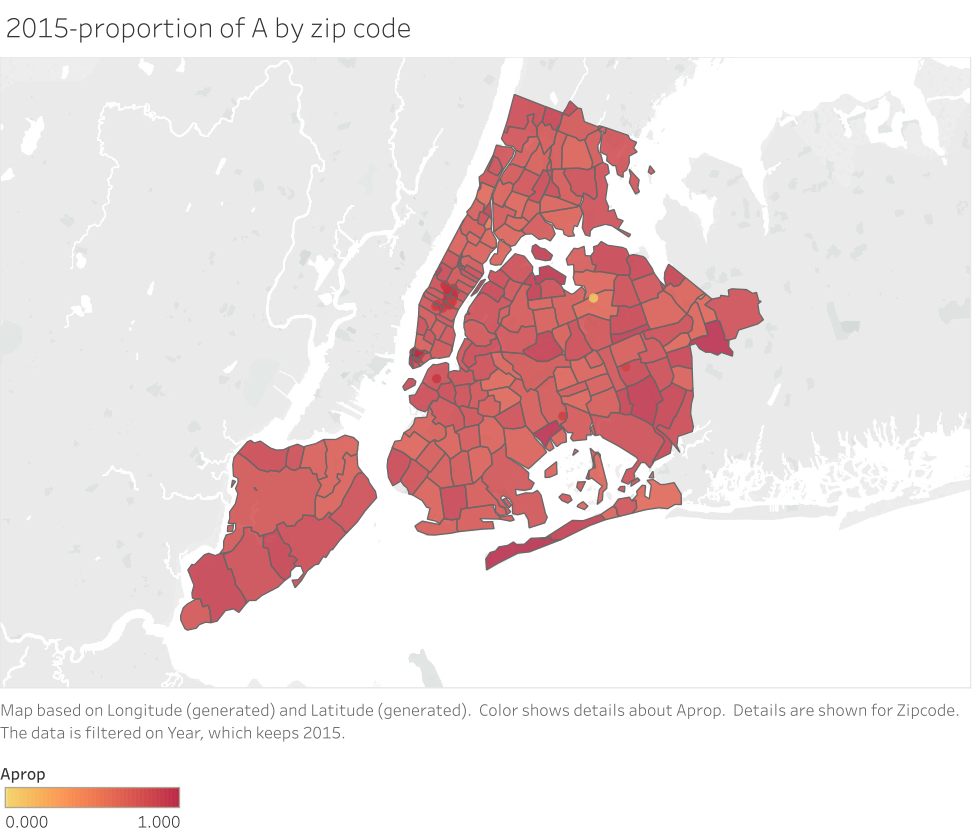
```

```{r}
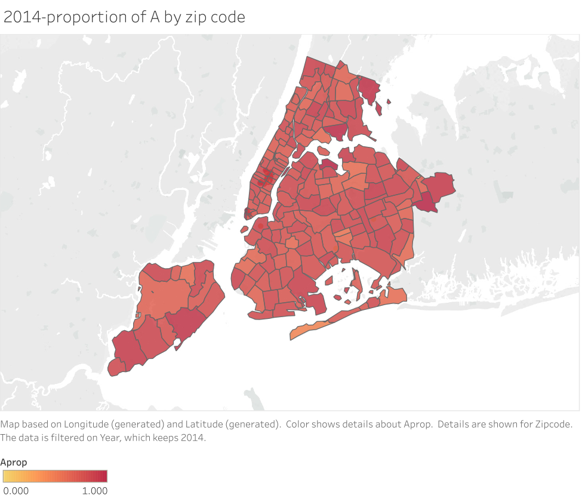
```

```{r}

```

Over the years, the proportion of A's has increased, as represented by the darker red shading of the map. It is too early to study 2017 in depth due to the limited number of inspections so far.

Let's look at how the proportion of B's change.

```{r}
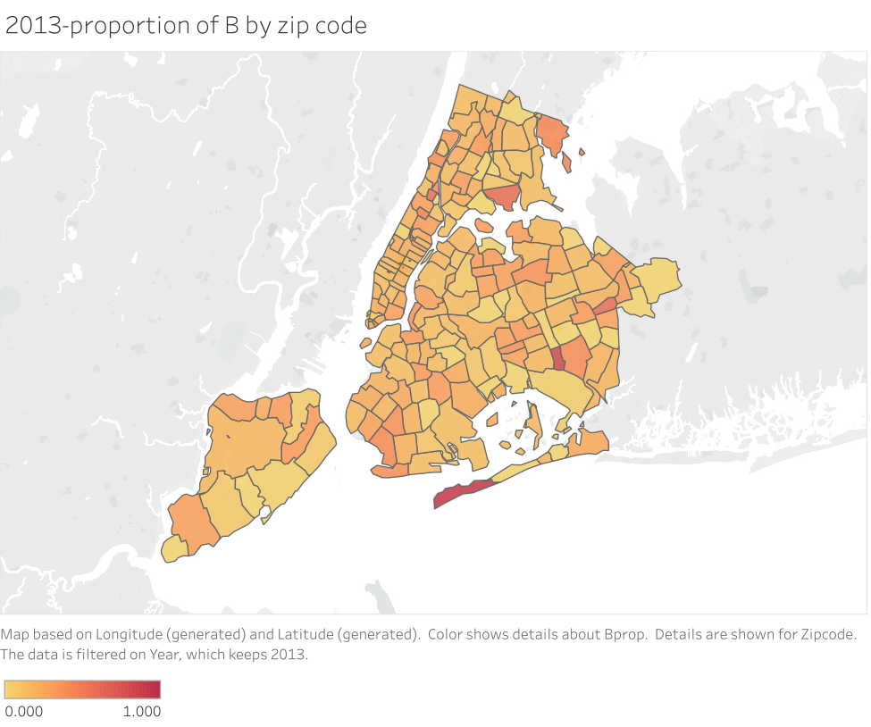
```

```{r}
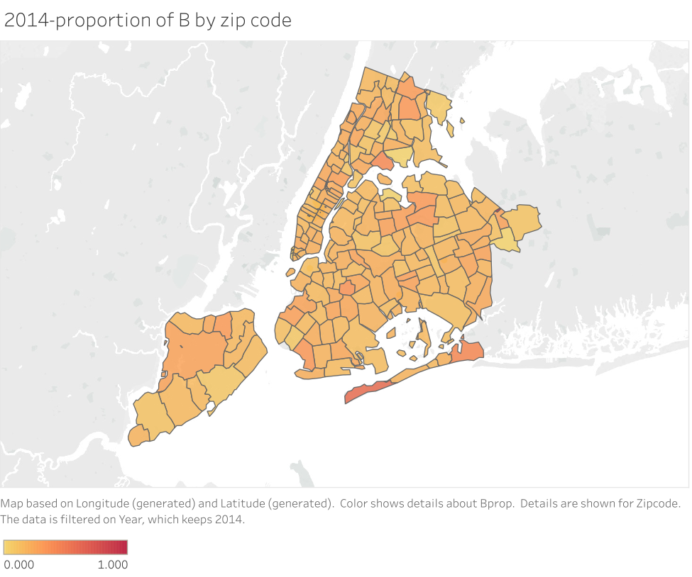
```

```{r}
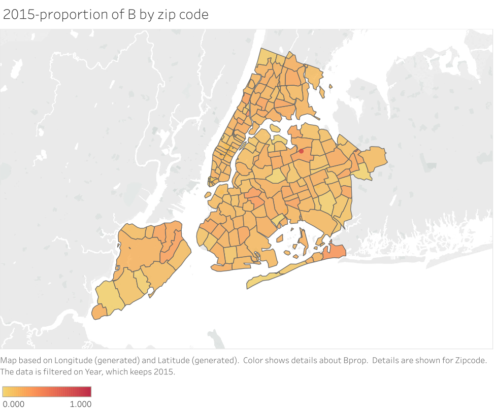
```

```{r}
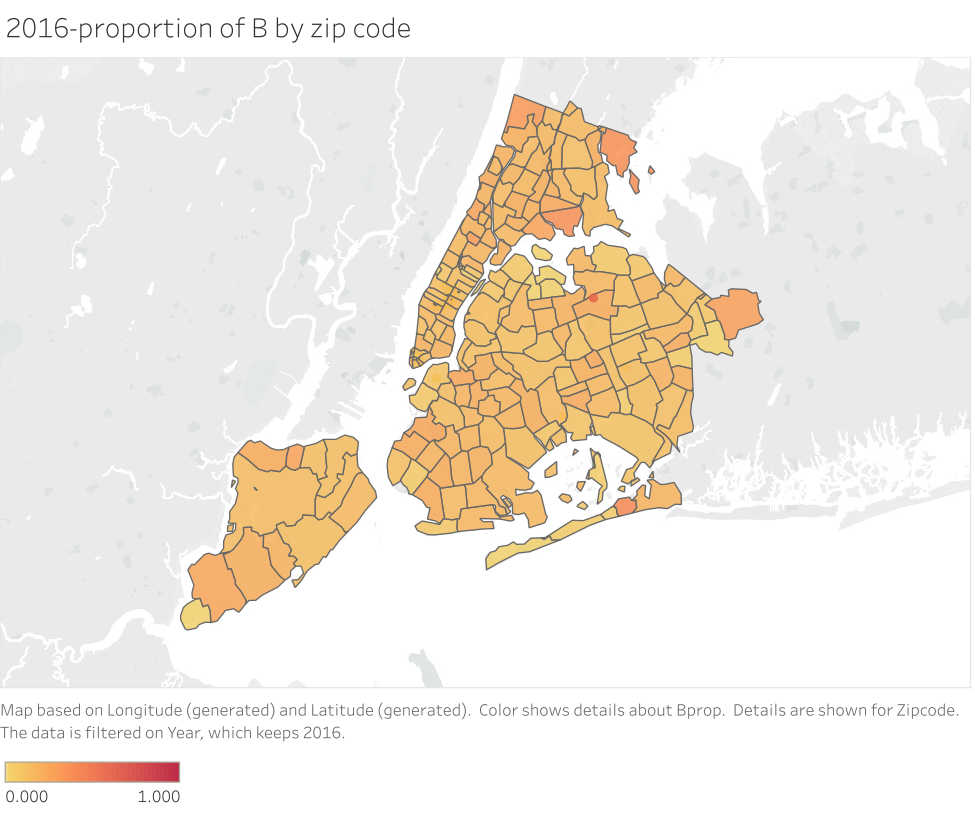
```

```{r}

```

We can see that over the years, there seem to be less B's which makes sense since over the years we have more grades of A.

Let's look at the average scores by neighborhood. We have already done so by cuisine.

```{r}

```

```{r}

```

```{r}
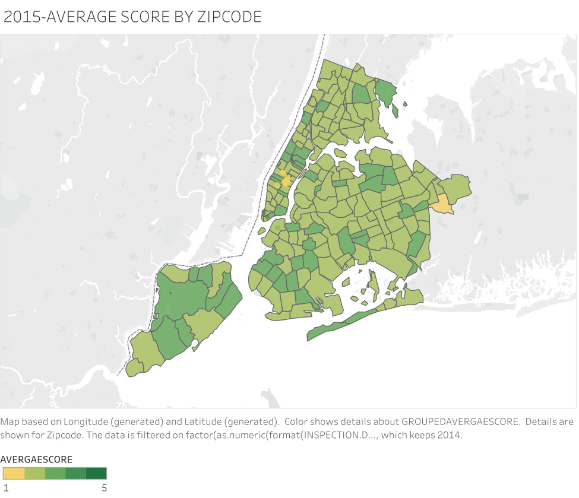
```

```{r}

```

```{r}
knitr::include_graphics('AvgViolScoreByZip2017.png')
```

Over the years, we have a lower Average Score. These NYC inspections must be prompting resturants to improve their facilities and follow regulations!

We decided to see which areas had the highest average number of reinspections. Maybe this can explain the better scores and grades over time.

```{r}
### DATA GENERATION
library(stringr)
reinspect <- ViolationsData %>% select(-CAMIS, -DBA, -BUILDING, -STREET, -CUISINE.DESCRIPTION, -BORO, -SCORE,
                                           -PHONE, INSPECTION.DATE, -ACTION, 
                                           -VIOLATION.CODE, 
                                           -CRITICAL.FLAG, -GRADE, -GRADE.DATE, 
                                           -RECORD.DATE)
reinspect$year<-factor(as.numeric( format(reinspect$INSPECTION.DATE , '%Y')))

#inspection_types <- INSPECTION.TYPE
reinspect <- reinspect %>%select(-INSPECTION.DATE)  %>% na.omit %>% filter(str_detect(INSPECTION.TYPE, "Re-inspection"))%>%group_by(VIOLATION.DESCRIPTION, year, ZIPCODE )  %>% tally# summarise(re = sum(str_count(reinspect$INSPECTION.TYPE, "Re-inspection")))
```

```{r}
knitr::include_graphics('AvgReinspect2013.png')
```

```{r}
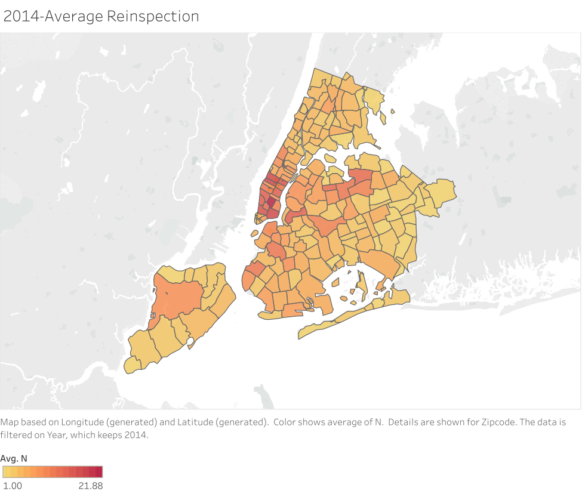
```

```{r}

```

```{r}

```

```{r}
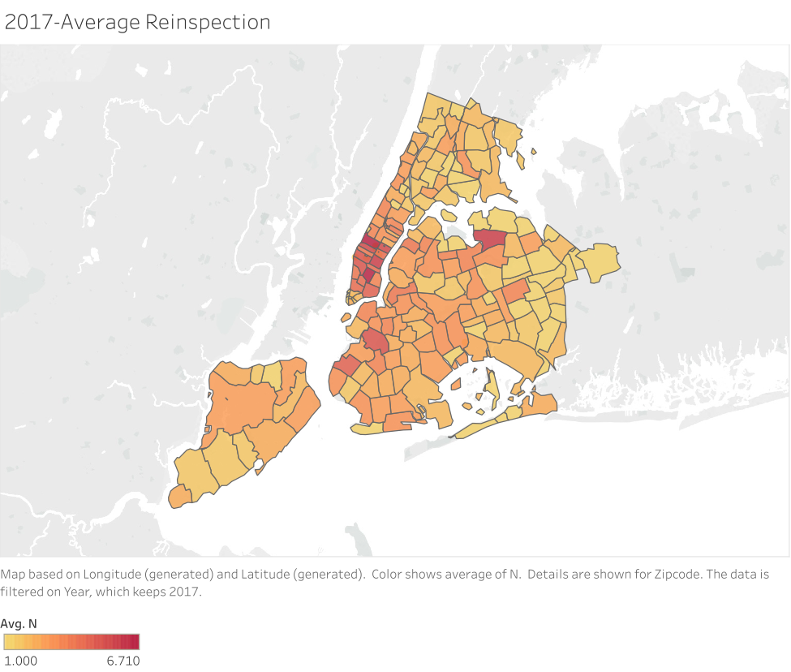
```

Interestingly enough, the areas with the most reinspections seem to be the ones in which the grades and scores improved. The system of reinspections must be working!


As a last bit of analysis, we decided to help settle a huge dilemna : Where should you get your coffee, Starbucks or Dunking Donuts?

```{r}
##DATA GENERATION CODE
library(stringr)
ChainssDf<-ViolationsData%>% mutate(isStarbucks=str_detect(DBA,"STARBUCK")) %>% mutate(isDunkin=str_detect(DBA,"DUNKIN"))
ChainssDf$DBA[ChainssDf$isStarbucks==TRUE]<-"STARBUCKS"
ChainssDf$DBA[ChainssDf$isDunkin==TRUE]<-"DUNKIN"
ChainssDf<-ChainssDf%>%filter(DBA %in% c("STARBUCKS","DUNKIN"))
ChainssDf<-ChainssDf%>%select(DBA,BORO,INSPECTION.DATE,ZIPCODE,SCORE,VIOLATION.DESCRIPTION,GRADE)
ChainssDf$year<-factor(as.numeric( format(ChainssDf$INSPECTION.DATE , '%Y')))
ChainssDf<-ChainssDf%>%select(-INSPECTION.DATE)
```

As you can see, Dunking Donuts has more critical violations than Starbucks in every Borough. Noticible differences are especially see in Brooklyn and Manhattan.
```{r}
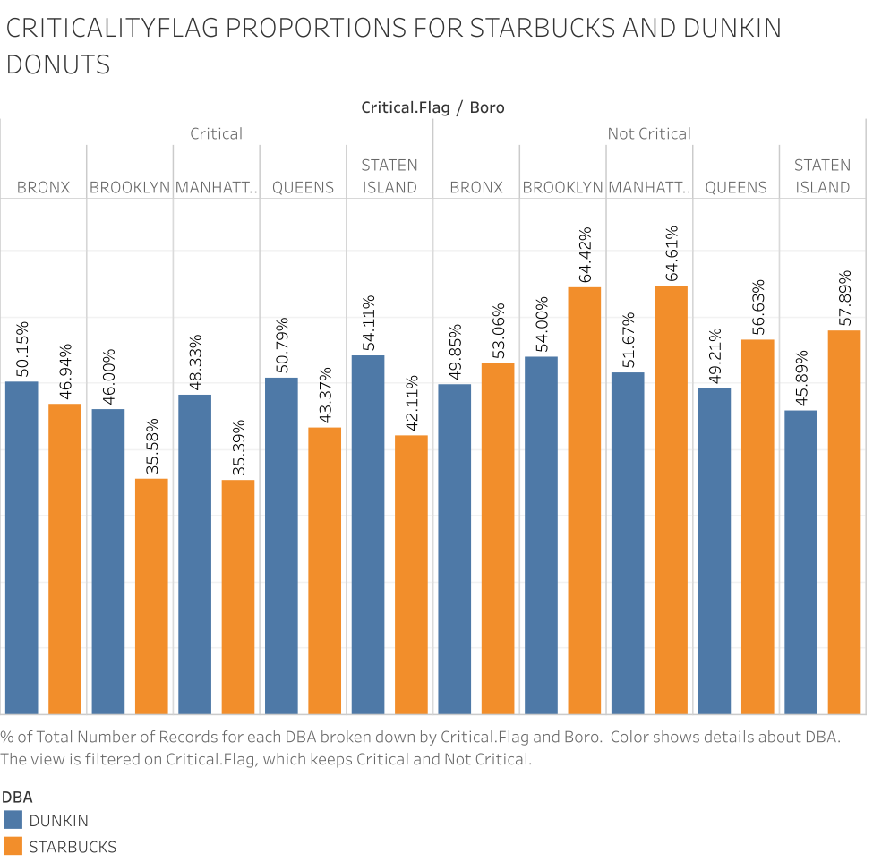
```


Both establishments shared the same top violations. Let's see what percentage of these violations each has. 
```{r}
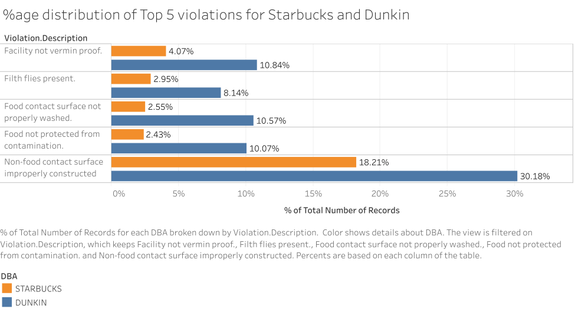
```
Once again, Starbucks is the winner!

What about the average score?
```{r}
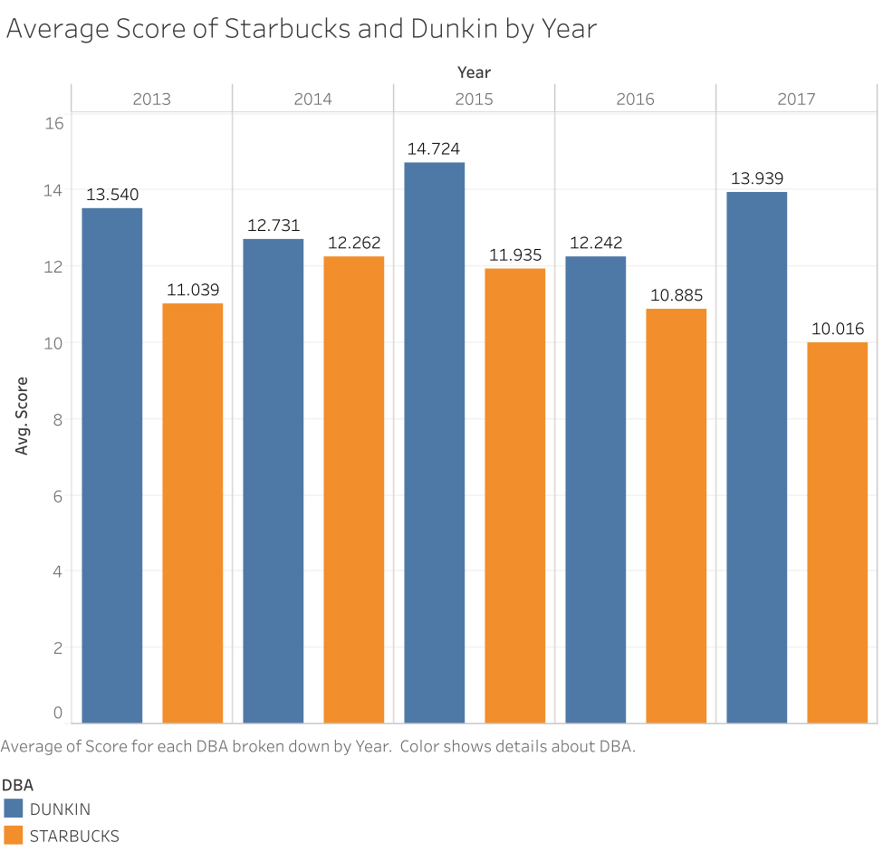
```

Regardles of the year, the average score of Dunking Donuts has been higher. The higher the score, the worse. Noticible differences are seen in 2015 and the first three months of 2017.

Let's see if the Borough your in should impact your choice.
```{r}
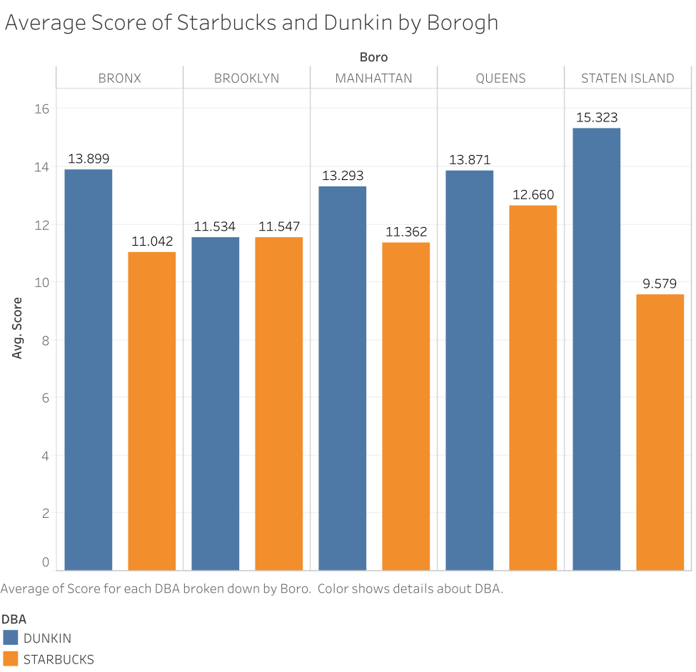
```

I guess when you're in Brooklyn, it doesn't matter but everywhere else, stick the Starbucks, especially you Staten Island folks!

## Conclusion
Many limitations included the missing data itself. We learned that sometimes, what may seem like an intuitive hypothesis, is actually completely false. There were not as many patterns as we anticipated in terms of Borough. The only thing we did see is that over time, the score and grade has increased, showing us that the inspections are working and that restuarants are improving their fcilities to receieve a better score. According to the website we receved the data frome, three fields are soon to be added as data logic becomes available to populate them accurately. Those fields are VIOLATION POINTS (the points assigned to a violation before or after adjudication, depending on whether adjudication has occurred), FINES TOTAL (the fine amount after adjudication), and DECISION DATE (adjudication date – or date a grade becomes final). With this information, we can do more analysis to see the fines of various violations and learn how each violation actually affects the score. With that, restaurants can focus on the main violations to improve their scores in the next inspection.


